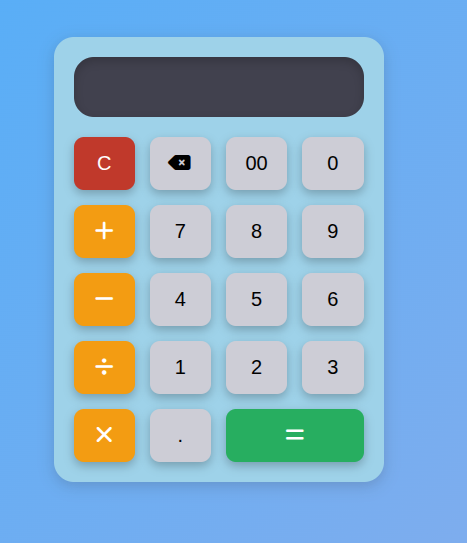
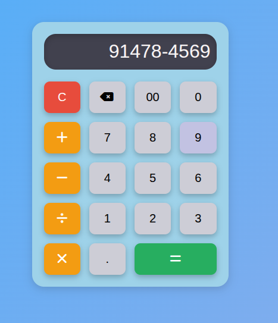
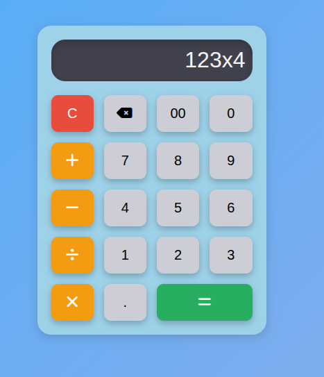
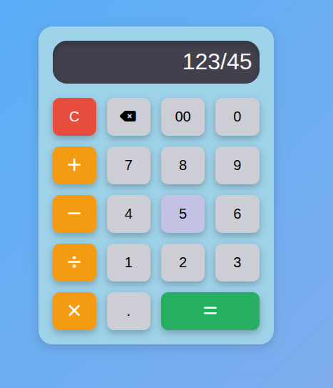

# 📱 Calculator — тестовое задание Frontend

Простой, стилизованный калькулятор, реализованный на **HTML / CSS / JavaScript**  
в рамках тестового задания для **IT-Mentor**.

---

## 🚀 Демо

👉 **GitHub Pages:**  
https://vitalykolod.github.io/test-test-itMentor/

---

## 🖼 Превью проекта

> Основной интерфейс калькулятора



---

## 🛠 Используемые технологии

- **HTML5**
- **CSS3**
  - Grid
  - Flexbox
  - Анимации
- **Vanilla JavaScript**
- **Font Awesome** (иконки)

---

## ✨ Функциональность

- Ввод чисел и математических операций  
  (`+ − × ÷`)
- Кнопка очистки (**C**)
- Удаление последнего символа
- Защита от некорректного ввода:
  - нельзя ввести несколько операторов подряд
  - нельзя начать выражение с оператора
  - нельзя ввести несколько точек в одном числе
- Обработка ошибок:
  - деление на 0
  - некорректные выражения
- Сохранение состояния при перезагрузке страницы  
  (**localStorage**)
- Адаптивный и стилизованный интерфейс

---

## 🧮 Примеры операций

### ➕ Сложение


### ➖ Вычитание


### ✖️ Умножение


### ➗ Деление


---

## 🧠 Особенности реализации

- Вся логика ввода защищена от некорректных сценариев
- Визуальный оператор **`x`** преобразуется в **`*`** перед вычислением
- Для вычислений используется `eval`, так как:
  - ввод ограничен кнопками интерфейса
  - отсутствует ввод произвольного текста  

> В реальном проекте был бы использован собственный парсер выражений.

---

## 📂 Структура проекта

```text
├── index.html
├── style.css
├── script.js
├── images/
│   ├── calculator-main.png
│   ├── addition.png
│   ├── subtraction.png
│   ├── multiplication.png
│   └── division.png
└── README.md

